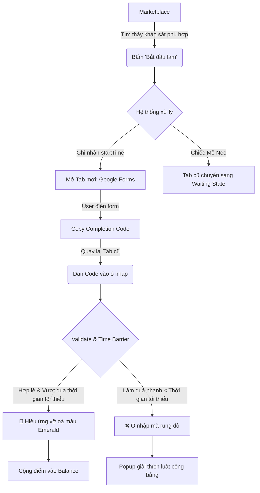
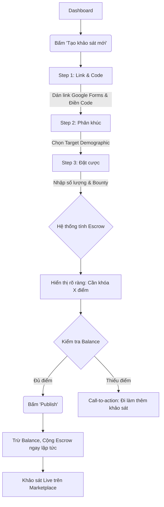

# UX Design Specification exe-prj

**Author:** Quan
**Date:** 2026-05-27

---

<!-- UX design content will be appended sequentially through collaborative workflow steps -->

## Executive Summary

### Project Vision

Trở thành mạng lưới thu thập dữ liệu nghiên cứu học thuật xác thực hàng đầu tại Việt Nam. Rescom chuyển đổi quá trình thu thập khảo sát từ việc "nhờ vả" sang một nền kinh tế nhiệm vụ vi mô win-win, nơi công sức (Điểm) có giá trị thực tế, đảm bảo sự trao đổi công bằng và tính toàn vẹn của dữ liệu cao.

### Target Users

**The Stressed Researcher (Sinh viên)**
- **Vấn đề:** Đang đối mặt với áp lực thời hạn cho luận văn/nghiên cứu và cần dữ liệu phản hồi khảo sát chất lượng cao, đúng đối tượng mục tiêu.
- **Hành vi:** Đăng tải khảo sát của mình và thiết lập mục tiêu nhân khẩu học khắt khe; làm khảo sát của người khác để kiếm điểm (dùng để đăng khảo sát hoặc quy đổi sau này).
- **Cảm xúc:** Thường xuyên lo âu về việc trễ deadline hoặc bị đánh rớt do dữ liệu mẫu kém chất lượng.

### Key Design Challenges

- **Xây dựng niềm tin & Tính minh bạch:** Người dùng cần nhìn thấy rõ giá trị thực của Điểm số và hiểu được hệ thống ký quỹ (escrow) cũng như cơ chế chống gian lận (Time Barrier) đang hoạt động một cách công bằng để bảo vệ họ.
- **Luồng hoàn thành khảo sát không độ trễ (Frictionless Flow):** Việc người dùng chuyển hướng sang nền tảng bên ngoài (Google Forms) rồi quay lại Rescom nhập mã xác nhận (Completion Code) là hành động cốt lõi. Luồng này phải cực kỳ mượt mà và rõ ràng để tránh rơi rớt người dùng. (Giải pháp: Mở tab mới với màn hình chờ "Mỏ neo" ở tab gốc).
- **Trải nghiệm thiết lập mục tiêu trực quan:** Giúp người tạo khảo sát (người đang bị stress) dễ dàng thiết lập các tiêu chí nhân khẩu học mà không cảm thấy phức tạp hay bối rối.

### Design Opportunities

- **Gamification (Trò chơi hóa) & Phản hồi trực quan:** Tận dụng các micro-animation khi người dùng kiếm điểm, mở khóa điểm (Locked Starter Points) hoặc hoàn thành nhiệm vụ để biến một công việc nhàm chán thành trải nghiệm thú vị, mang lại cảm giác thành tựu.
- **Thiết kế giải tỏa lo âu:** Cung cấp các biểu đồ tiến độ rõ ràng và mang tính khích lệ (ví dụ: "Đã thu thập 30/50 phản hồi - Sắp hoàn thành rồi!", "Tiến độ: Nhanh hơn dự kiến") để xoa dịu trực tiếp nỗi lo trễ deadline của sinh viên.

## Core User Experience

### Defining Experience

Hành động cốt lõi và thường xuyên nhất của Rescom là **Vòng lặp Kiếm điểm (Earn Loop)**: Người dùng tìm thấy một khảo sát phù hợp -> Nhấn "Bắt đầu" -> Sang Google Forms điền -> Quay lại Rescom nhập Mã hoàn thành (Completion Code) -> Nhận điểm. Toàn bộ vòng lặp này phải tạo ra cảm giác như một nhiệm vụ vi mô (micro-task) liền mạch, không có độ trễ hay sự mơ hồ.

### Platform Strategy

- **Nền tảng:** Ứng dụng Web (Web App), ưu tiên thiết kế Mobile-first. Sinh viên thường tranh thủ làm khảo sát trên điện thoại giữa các giờ học.
- **Tương tác:** Tối ưu hóa cho các thao tác chạm (Touch-friendly) trên thiết bị di động, đặc biệt là nút copy/paste mã xác nhận. Không yêu cầu tính năng ngoại tuyến (offline) do tính chất thời gian thực của Time Barrier.

### Effortless Interactions

- **Lọc tự động (Zero-Friction Matching):** Người dùng không bao giờ phải mất công tìm kiếm hay lọc khảo sát. Chợ khảo sát (Marketplace) tự động đối chiếu hồ sơ nhân khẩu học của họ và chỉ hiển thị những khảo sát họ ĐỦ ĐIỀU KIỆN tham gia.
- **Hiệu ứng Nhận điểm (Magical Point Transfer):** Ngay khi nộp đúng mã xác nhận, thao tác chuyển điểm từ Escrow sang Balance của người dùng diễn ra ngay lập tức kèm theo hiệu ứng hình ảnh (micro-animation) thỏa mãn.

### Critical Success Moments

- **Khoảnh khắc "Aha!":** Lần đầu tiên người dùng hoàn thành một khảo sát cộng đồng và chứng kiến 50 Điểm Khởi đầu (Locked Starter Points) của họ được "Mở khóa", trở thành tài sản thực sự có thể sử dụng.
- **Khoảnh khắc "Đáng đồng tiền bát gạo":** Khi một người tạo khảo sát (Stressed Researcher) nạp điểm vào Escrow và thấy số lượng phản hồi từ ĐÚNG ĐỐI TƯỢNG mục tiêu tăng lên chỉ sau vài giờ, mà không cần phải đi "xin xỏ" bất kỳ ai.

### Experience Principles

- **Sự thật và Minh bạch (Trust through Transparency):** Trạng thái khóa/mở điểm, số dư hiện tại và cơ chế chống gian lận phải luôn được hiển thị rõ ràng, không giấu giếm.
- **Chiếc Mỏ Neo (The Anchor Tab):** Khi chuyển hướng người dùng sang form bên ngoài, tab Rescom phải luôn tự động chuyển sang Màn hình Chờ (Waiting State) đếm giờ và nhắc nhở nhập mã, đóng vai trò mỏ neo kéo người dùng trở lại.

## Desired Emotional Response

### Primary Emotional Goals

- **Sự an tâm & Sự nhẹ nhõm (Relief & Reassurance):** Cảm giác trút bỏ được gánh nặng khi người dùng (Stressed Researcher) nhấn nút "Publish". Họ biết chắc chắn rằng dữ liệu của họ đang được tự động thu thập.
- **Niềm tin tuyệt đối (Absolute Trust):** Người dùng phải cảm thấy an toàn khi "ký quỹ" điểm số của mình, tin tưởng rằng hệ thống công bằng và không ai có thể lấy điểm của họ bằng các thủ thuật gian lận.

### Emotional Journey Mapping

- **Lần đầu tiếp cận (Onboarding):** Tò mò pha lẫn một chút hoài nghi ("Cái này có lừa đảo không? Có ra được data thật không?"). 
- **Khi đăng tải khảo sát:** Lo âu chuyển dần sang nhẹ nhõm.
- **Trong lúc chờ đợi phản hồi:** Sự háo hức và mong đợi.
- **Khi tự mình làm khảo sát kiếm điểm:** Tập trung, sau đó là sự thỏa mãn và cảm giác thành tựu khi thấy điểm "rơi" vào túi.
- **Khi bị chặn bởi hệ thống chống gian lận (Time Barrier):** Tôn trọng sự nghiêm minh của hệ thống. Họ hiểu hệ thống đang bảo vệ tính công bằng, chứ không phải đang phạt họ vô lý.

### Micro-Emotions

- **Trust vs. Skepticism (Niềm tin vs Hoài nghi):** Đánh bại sự hoài nghi bằng sự minh bạch tột độ trong lịch sử giao dịch điểm.
- **Accomplishment vs. Frustration (Thành tựu vs Bực bội):** Tạo ra cảm giác thành tựu bằng các hiệu ứng ăn mừng nhỏ (micro-celebrations) mỗi khi hoàn thành khảo sát.
- **Relief vs. Anxiety (Nhẹ nhõm vs Lo âu):** Xóa bỏ lo âu bằng cách liên tục cập nhật trạng thái tiến độ thời gian thực.

### Design Implications

- **Để xây dựng Niềm tin (Trust) -> Hướng thiết kế UX:** Sử dụng các pattern thiết kế UI mang hơi hướng "ngân hàng số" (Banking app) cho ví Điểm (Ledger) và Quỹ (Escrow). Giao diện lịch sử giao dịch phải thật rõ ràng, chuyên nghiệp và có vẻ "bất biến".
- **Để tạo sự Nhẹ nhõm (Relief) -> Hướng thiết kế UX:** Nhấn mạnh vào các thanh tiến độ (Progress bars) và sử dụng tone giọng (copywriting) thân thiện, trấn an (Ví dụ: "Hãy nghỉ ngơi, hệ thống đang đi tìm 50 người trả lời cho bạn!").
- **Để tạo cảm giác Thành tựu (Accomplishment) -> Hướng thiết kế UX:** Ứng dụng Gamification (Trò chơi hóa) với các hiệu ứng vỡ òa, lấp lánh khi người dùng "Mở khóa" thành công 50 Điểm khởi đầu (Locked Starter Points).

### Emotional Design Principles

Mọi quyết định thiết kế trên Rescom phải trả lời được câu hỏi: *"Giao diện này có làm cho sinh viên đang stress cảm thấy an tâm hơn và tin tưởng hệ thống hơn không?"* Nếu không, chúng ta phải thiết kế lại.

## UX Pattern Analysis & Inspiration

### Inspiring Products Analysis

- **Các ứng dụng Ví điện tử/Ngân hàng số (Momo, TPBank):** Xuất sắc trong việc xây dựng niềm tin. Giao diện luôn ưu tiên hiển thị số dư to, rõ ràng, lịch sử giao dịch rành mạch với màu sắc xanh/đỏ (+/-). Cảm giác mang lại là sự bảo mật và minh bạch tuyệt đối.
- **Duolingo:** Bậc thầy về Gamification và tạo động lực. Các hiệu ứng ăn mừng nhỏ (micro-celebrations) khi hoàn thành bài học, hoặc cách họ hiển thị tiến trình (progress) giúp người dùng bị "nghiện" việc hoàn thành các task nhỏ.
- **Airbnb / Typeform:** Tinh tế trong việc chẻ nhỏ các form nhập liệu phức tạp thành từng bước (Wizard pattern). Điều này giúp giảm thiểu đáng kể tải lượng nhận thức (cognitive load) cho người dùng.

### Transferable UX Patterns

- **Mẫu Ví Điện Tử (The Digital Wallet Pattern):** Xây dựng một tab "Ledger" (Sổ điểm) riêng biệt. Hiển thị rõ: *Điểm đang có*, *Điểm đang bị khóa (Escrow)*, và *Lịch sử giao dịch*. Áp dụng trực tiếp để giải quyết bài toán "Absolute Trust".
- **Hiệu ứng "Mở khóa" (The Unlock Celebration):** Áp dụng pattern của Duolingo cho khoảnh khắc người dùng hoàn thành khảo sát đầu tiên và 50 Locked Starter Points được mở khóa. Một hiệu ứng hình ảnh (confetti, âm thanh nhỏ) sẽ tạo ra "Khoảnh khắc Aha!".
- **Quy trình từng bước (The Stepper/Wizard):** Dành cho luồng "Tạo khảo sát". Thay vì một form dài thò lò đòi hỏi dán link, chọn nhân khẩu học, nhập số điểm... ta sẽ chia làm 3 bước đơn giản (1. Link -> 2. Đối tượng -> 3. Đặt cược điểm). Giúp "Stressed Researcher" bớt hoảng loạn.

### Anti-Patterns to Avoid

- **"Bức tường Bộ lọc" (The Wall of Filters):** Giống như các trang tìm việc truyền thống, bắt người dùng tự lọc ngành học, năm học... Thay vào đó, áp dụng Zero-Friction Matching: Hệ thống chỉ tự động hiển thị những gì họ đủ điều kiện làm. Giấu đi mọi bộ lọc thừa.
- **Chi phí ẩn (Hidden Costs UI):** Không bao giờ che giấu sự hao hụt điểm số. Khi đưa điểm vào Escrow, UI phải giải thích rõ ràng "Số điểm này sẽ bị trừ đi, nhưng sẽ được hoàn lại nếu không ai làm khảo sát".
- **Thông báo lỗi chung chung (Generic Error States):** Nhất là khi Time Barrier chặn một Completion Code. Thay vì "Lỗi", phải nói rõ: *"Bạn đã hoàn thành khảo sát này trong 30 giây (nhanh hơn thời gian tối thiểu 3 phút). Để đảm bảo công bằng, mã này không được chấp nhận."* để giữ vững sự tôn trọng luật chơi.

### Design Inspiration Strategy

**Những gì cần Áp dụng (Adopt):**
- Giao diện lịch sử giao dịch kiểu ngân hàng (Banking-style Ledger) cho hệ thống Điểm.
- Mẫu Wizard (từng bước) cho luồng Đăng tải khảo sát.

**Những gì cần Tùy biến (Adapt):**
- Hiệu ứng Gamification: Vẫn tạo sự hứng khởi nhưng phải tiết chế, giữ được vẻ chuyên nghiệp của một công cụ hỗ trợ học thuật, không quá trẻ con.

**Những gì cần Tránh (Avoid):**
- Giao diện bộ lọc tìm kiếm phức tạp cho người trả lời khảo sát.
- Các thông báo lỗi mập mờ trong luồng nhập Code (Earn Loop).

## 2. The Defining Experience (Trải nghiệm Định hình)

### 2.1 Defining Experience

Trải nghiệm định hình làm nên tên tuổi của Rescom là **"Vòng lặp Ký quỹ & Xác thực" (Escrow & Validation Loop)**. Đây là khoảnh khắc người dùng nhận ra: "À, hệ thống này tính điểm thật, và bắt buộc phải làm đàng hoàng mới có điểm". Nếu chúng ta làm tốt luồng này, sinh viên sẽ tự truyền tai nhau sử dụng.

### 2.2 User Mental Model

- **Mô hình hiện tại:** Sinh viên đang quen với văn hóa "xin xỏ chéo" trên các group Facebook/Zalo, nơi đầy rẫy sự lừa dối (người ta hứa làm giúp nhưng toàn điền rác hoặc bùng kèo).
- **Kỳ vọng:** Khi tiếp cận Rescom, ban đầu họ sẽ mang tâm lý hoài nghi, cho rằng "Điểm" chỉ là ảo và chả ai thèm làm khảo sát của mình đâu.
- **Giải pháp:** Phá vỡ sự hoài nghi bằng cách cho họ thấy dòng chảy của Điểm số. Khi một khảo sát được đăng, Điểm phải hiển thị trạng thái "Bị khóa" (Escrow) ngay lập tức. Cảm giác này giống như việc tiền được giữ bởi bên thứ 3 an toàn (như Shopee/Tiktok Shop).

### 2.3 Success Criteria

- **Khoảnh khắc "This just works":** Khi người dùng dán link Google Form vào, hệ thống tự động tính toán tổng số Điểm cần ký quỹ (Dựa trên Bounty x Target) một cách rõ ràng trước khi bấm nút Publish.
- **Tốc độ:** Thao tác nhập Mã hoàn thành (Completion Code) và nhận điểm phải cho cảm giác TỨC THÌ (instant feedback). Không có độ trễ loading quá 1 giây.
- **Tính tự động:** Hệ thống tự động từ chối các mã nộp quá nhanh (Time Barrier) mà không cần người tạo khảo sát phải vào check tay.

### 2.4 Novel UX Patterns

- **Kết hợp Cũ và Mới:** Việc nhập một đoạn code để xác thực là pattern cũ (ai cũng hiểu). Điểm mới (Novel) là khái niệm **Time Barrier + Escrow**.
- **Metaphor (Ẩn dụ hình ảnh):** Sử dụng biểu tượng "Ổ khóa" cho Escrow và đồng hồ đếm ngược cho Time Barrier để giải thích luật chơi bằng hình ảnh thay vì những dòng text dài dòng.

### 2.5 Experience Mechanics (Cơ chế chi tiết của Vòng lặp)

- **1. Initiation (Bắt đầu):** Người dùng lướt Marketplace, thấy một khảo sát đúng chuyên ngành của mình. Bấm "Bắt đầu làm".
- **2. Interaction (Tương tác):** 
  - Hệ thống ghi nhận `startTime`. 
  - Mở một tab mới dẫn đến Google Forms. 
  - Tab Rescom cũ lập tức chuyển sang trạng thái "Đang chờ mã xác nhận..." (Waiting State) với ô nhập mã nổi bật.
- **3. Feedback (Phản hồi):**
  - Người dùng điền xong form, lấy mã, quay lại tab Rescom dán vào.
  - *Thành công:* Xác thực mã đúng và thời gian đủ -> Tung hoa confetti, số dư điểm nảy lên.
  - *Thất bại (gian lận thời gian):* Ô nhập mã rung (shake) nhẹ màu đỏ, hiện thông báo giải thích rõ ràng về luật Time Barrier.
- **4. Completion (Hoàn thành):** Điểm chính thức nằm trong ví (Balance), người dùng có thể dùng ngay điểm này để đăng khảo sát của riêng mình.

## Visual Design Foundation

### Color System

Chúng ta sẽ không dùng các màu cơ bản nhàm chán. Bảng màu được tinh chỉnh (HSL tailored colors) để cân bằng giữa sự chuyên nghiệp của ngân hàng số và sự trẻ trung của sinh viên:

- **Primary (Trust Blue):** Màu xanh dương đậm, sâu (Dark Navy/Slate Blue). Mang lại cảm giác vững chãi, an toàn tuyệt đối. Dành cho thanh điều hướng và các nút bấm chính (Publish).
- **Accent/Success (Emerald Green):** Màu xanh ngọc lục bảo rực rỡ. Dành riêng cho số dư điểm dương (+ Điểm) và các thông báo hoàn thành. Gợi cảm giác thịnh vượng, thành tựu.
- **Escrow/Warning (Amber):** Màu hổ phách/vàng cam. Dành cho trạng thái điểm đang bị khóa (Escrow). Đủ nổi bật để người dùng lưu ý nhưng mang lại cảm giác "đang được giữ hộ" chứ không phải là báo lỗi nguy hiểm.
- **Surface:** Hỗ trợ giao diện sáng (Sleek Light Mode) với nền xám nhạt (off-white) để tôn lên các thẻ Card, và giao diện tối (Dark Mode) êm dịu cho những sinh viên chạy deadline lúc 2h sáng.

### Typography System

- **Primary Font (Giao diện chung):** `Inter`. Một font chữ không chân (sans-serif) hiện đại, sạch sẽ và có độ trung tính cao. Đảm bảo mọi dòng text hướng dẫn đều cực kỳ dễ đọc.
- **Display Font (Dành riêng cho số liệu):** `Outfit` hoặc `Plus Jakarta Sans`. Các font này có các con số hình học, bo tròn đẹp mắt, làm cho số "Điểm" trông to, rõ ràng và hấp dẫn hơn (rất quan trọng cho Gamification).
- **Cấu trúc:** Áp dụng hệ thống phân cấp rõ rệt. Số điểm và tiêu đề luôn to và đậm, trong khi các đoạn text giải thích luật chơi thì dùng màu xám dịu để không làm rối mắt.

### Spacing & Layout Foundation

- **Hệ thống khoảng cách (Base-4 System):** Sử dụng bội số của 4px (8, 16, 24, 32...) tuân thủ chuẩn của Tailwind CSS.
- **Card-Based Layout:** Vì theo đuổi Mobile-first, mọi đơn vị thông tin (một khảo sát trên chợ, một giao dịch điểm) đều được gói gọn trong các thẻ (Card).
- **Độ bo góc (Border Radius):** Sử dụng góc bo mềm mại (12px - 16px) thay vì góc vuông sắc cạnh. Đường cong giúp xoa dịu tâm lý căng thẳng của người dùng (Stressed Researcher).

### Accessibility Considerations

- **Độ tương phản:** Màu chữ và nền (đặc biệt là thông tin về Điểm số) phải đạt chuẩn WCAG AA hoặc AAA để sinh viên lướt app ngoài trời nắng vẫn đọc được.
- **Kích thước chạm (Touch Targets):** Các nút bấm (như nút Copy Code, Bắt đầu làm) tối thiểu phải đạt 44x44px để không bị bấm hụt trên điện thoại.

## Design Direction Decision

### Design Directions Explored

- **D1: The Neobanking:** Tập trung tối đa vào cấu trúc, sự an toàn và minh bạch với tone màu trầm ấm, chuyên nghiệp.
- **D2: The Gamified:** Mang hơi hướng trẻ trung, năng động với bo góc lớn (rounded corners), màu sắc rực rỡ và các yếu tố tạo cảm giác thành tựu.
- **D3: Minimal Academic:** Tối giản, thanh lịch, ưu tiên nhiều khoảng trắng cho môi trường nghiên cứu học thuật.

### Chosen Direction

**D2: The Gamified (Ứng dụng Gamification vui nhộn, trẻ trung)**

### Design Rationale

Việc bạn chọn hướng tiếp cận Gamified (D2) là một quyết định rất sáng suốt cho sản phẩm này vì:
- **Giảm Căng Thẳng (Stress Relief):** Đối tượng "Stressed Researcher" đang mang tâm lý rất nặng nề vì deadline luận văn. Một giao diện vui nhộn, mềm mại với những hiệu ứng ăn mừng nhỏ (micro-celebrations) sẽ giúp xoa dịu tâm trạng của họ tốt hơn nhiều so với một giao diện ngân hàng khô khan.
- **Tạo động lực (Motivation & Retention):** Sự sống còn của Rescom nằm ở việc người dùng phải đi làm khảo sát của người khác (Earn Loop). Các yếu tố gamification (viền phát sáng, icon ngộ nghĩnh, hiệu ứng cộng điểm) tạo ra "Moment of Delight" (Khoảnh khắc vui vẻ) khích lệ họ tiếp tục "cày" điểm.
- **Đồng điệu Gen Z:** Hoàn toàn phù hợp với nhân khẩu học mục tiêu (sinh viên), những người đã quá quen thuộc và thích thú với các app có thiết kế hướng đến cảm xúc (như Duolingo, Tiktok).

### Implementation Approach

- Áp dụng các **border radius lớn** (ví dụ: `rounded-2xl`, `rounded-3xl` trong Tailwind) cho các khối Card (thẻ khảo sát, ví điểm) để tạo sự thân thiện, an toàn.
- Sử dụng màu **Emerald Green (Xanh ngọc)** làm màu chủ đạo cho các hành động chính (Call-to-Action) nhằm tạo cảm giác "Thành công / Tích cực / Go".
- Thiết kế các **Empty States (Trạng thái rỗng)** thật vui nhộn thay vì thông báo lỗi nhàm chán (ví dụ: màn hình ví rỗng sẽ có hình vẽ một chiếc ví đang đói meo chờ bạn đi làm khảo sát).
- Chuẩn bị tinh thần tích hợp các thư viện animation nhẹ nhàng (như Framer Motion) để code các hiệu ứng nảy (spring bounce) hoặc vỡ òa khi người dùng nhập đúng Completion Code.

## User Journey Flows

### 1. The Earn Journey (Vòng lặp Cày điểm)

Đây là luồng cốt lõi nhất. Trọng tâm của luồng này là sự trơn tru khi chuyển đổi giữa Rescom và nền tảng thứ 3 (Google Forms) và khoảnh khắc bùng nổ (Moment of Delight) khi nhận điểm.

### 2. The Publish Journey (Vòng lặp Đăng khảo sát)

Trọng tâm của luồng này là giảm tải áp lực (cognitive load) cho Stressed Researcher thông qua thiết kế từng bước (Wizard) và làm rõ cơ chế Escrow để tạo niềm tin.

### Journey Patterns (Các mẫu thiết kế lặp lại)

- **The Split-Tab Navigation:** Luôn sử dụng cơ chế chia tab (Tab Rescom làm mỏ neo, Tab mới làm không gian làm việc) để không làm gián đoạn trải nghiệm trên app chính.
- **The Stepper (Wizard):** Bất kỳ form nhập liệu nào có quá 3 trường thông tin (như luồng Tạo khảo sát) đều phải được bẻ nhỏ thành từng bước. Không bao giờ hiển thị "bức tường chữ" khiến người dùng ngộp thở.

### Flow Optimization Principles

- **Minimizing steps to value:** Trong luồng Earn Journey, chỉ cần đúng 1 nút bấm "Bắt đầu làm" là quá trình tính giờ bắt đầu. Không bắt người dùng xác nhận nhiều lần.
- **Error Recovery Gracefully:** Ở luồng Publish, nếu người dùng thiếu điểm, thay vì chỉ hiện báo lỗi màu đỏ bực bội, hãy hiện một nút bấm (Emerald Green) khích lệ họ: *"Bạn chỉ còn thiếu 10 điểm, đi làm 1 khảo sát ngắn thôi là đủ!"*.

## Component Strategy

### Design System Components (shadcn/ui Coverage)

Với việc sử dụng shadcn/ui, chúng ta có thể tận dụng (và điều chỉnh bo góc `rounded-2xl` cho đúng chuẩn D2 Gamified) các component có sẵn sau:
- **Navigation & Layout:** `Tabs`, `Sheet` (cho menu trên mobile).
- **Forms (Wizard):** `Input`, `Select`, `Textarea`, `Label`.
- **Feedback:** `Toast` (Thông báo nhỏ ở góc màn hình), `Dialog` (cho các Popup giải thích luật Time Barrier), `Progress` (thanh tiến độ tải trang/khảo sát).
- **Cơ bản:** `Button`, `Card` (làm nền tảng).

### Custom Components (Thành phần thiết kế riêng)

Dựa trên 2 hành trình (Earn & Publish Journey), hệ thống shadcn/ui không có sẵn các thành phần đặc thù sau, chúng ta phải tự xây dựng:

#### 1. Survey Marketplace Card (Thẻ Khảo sát trên Chợ)
- **Purpose:** Cho phép người dùng lướt và quét nhanh thông tin khảo sát để quyết định có "Bắt đầu làm" hay không.
- **Anatomy (Cấu tạo):** Tiêu đề khảo sát, Các tag nhân khẩu học (ví dụ: `Gen Z`, `IT`), Phần thưởng (Bounty - được bôi màu Emerald nổi bật), và Nút bấm "Bắt đầu làm".
- **States:** Default, Hover (Thẻ khẽ nhấc lên trên `translate-y-1` và viền sáng lên để tạo cảm giác Gamified tương tác).

#### 2. The Ledger Widget (Ví Điểm đa năng)
- **Purpose:** Hiển thị minh bạch tài sản của người dùng, củng cố sự an tâm (Absolute Trust).
- **Anatomy:** Số dư (Balance) hiển thị siêu to bằng font `Outfit`. Bên dưới là số điểm đang khóa (Escrow) kèm theo icon 🔒 (ổ khóa màu Amber).
- **States:** Loading (Skeleton), Default. Không có trạng thái lỗi vì số điểm phải luôn được fetch thành công từ Database.

#### 3. Time-Barrier Code Input (Ô nhập mã Xác thực)
- **Purpose:** Trái tim của Earn Loop. Nơi người dùng dán Completion Code và nhận phản hồi tức thì.
- **Anatomy:** Một ô Input to, rõ ràng, căn giữa.
- **States (Quan trọng):**
  - *Default:* Viền xám nhạt, chờ nhập.
  - *Validating:* Hiện vòng xoay loading nhẹ.
  - *Success:* Viền chuyển xanh Emerald sáng rực, nảy lên (bounce).
  - *Time-Barrier Error:* Viền chuyển đỏ, rung lắc ngang (Shake animation) để cảnh báo người dùng làm quá nhanh.

### Component Implementation Strategy

- **Thừa kế (Composition):** Mọi Custom Component phải được xây dựng bên trong component `Card` của shadcn/ui để giữ được cấu trúc DOM và Accessibility (ARIA labels) chuẩn mực.
- **CSS Variants:** Sử dụng Tailwind CSS `group-hover` và `peer` để xử lý các animation trực tiếp bằng CSS thay vì phụ thuộc quá nhiều vào Javascript, giúp app chạy mượt trên Mobile.
- **Animation Library:** Cài đặt Framer Motion cho các hiệu ứng vỡ òa (Confetti) và nảy (Spring Bounce) của ô nhập mã.

### Implementation Roadmap

Để giúp team Dev code hiệu quả, đây là lộ trình:
- **Phase 1 (Core - Sinh tồn):** Xây dựng *Survey Marketplace Card* và *Time-Barrier Code Input*. Phải xong 2 cái này thì Earn Loop mới chạy được.
- **Phase 2 (Trust - Xây dựng niềm tin):** Chỉnh sửa các form của shadcn/ui thành dạng Wizard (từng bước) và code *Ledger Widget*. Hoàn thiện Publish Loop.
- **Phase 3 (Delight - Vui nhộn):** Thêm Framer Motion, làm các hiệu ứng rung lắc, viền sáng, và Confetti ăn mừng.

## UX Consistency Patterns

### Button Hierarchy (Phân cấp Nút bấm)

Sử dụng hệ thống nút bo tròn lớn (`rounded-xl` hoặc `rounded-2xl`) để tạo cảm giác thân thiện (bóp bóp như thạch).
- **Primary Action (Hành động chính):** Màu Emerald Green rực rỡ, chữ trắng đậm. Bắt buộc phải có hiệu ứng nảy nhẹ (`active:scale-95`) khi nhấn vào. *Dùng cho: "Bắt đầu làm", "Publish", "Nhận điểm".*
- **Secondary Action (Hành động phụ):** Màu nền xám nhạt (`bg-slate-100`), chữ màu xám đậm. *Dùng cho: "Quay lại", "Bỏ qua", "Xem thêm".*
- **Danger Action (Hành động rủi ro):** Màu nền đỏ nhạt (`bg-red-50`), chữ đỏ đậm (`text-red-600`) - Không dùng nền đỏ tươi chói lọi để tránh gây căng thẳng (stress). *Dùng cho: "Xóa khảo sát", "Hủy".*

### Feedback Patterns (Phản hồi hệ thống)

- **Thành công (Success):** Sử dụng `Toast` (Thông báo nhỏ trượt từ dưới lên) với icon 🎉 hoặc dấu check màu xanh. Ứng dụng cho các hành động mang tính vỡ òa (ví dụ: Điểm vừa được cộng vào ví).
- **Lỗi nghiêm trọng / Cảnh báo (Error / Warning):** Sử dụng `Dialog Modal` (Popup nổi lên giữa màn hình, làm mờ background). Phải khóa màn hình lại bắt người dùng đọc (ví dụ: Lỗi vi phạm Time Barrier). Lời văn phải giải thích rõ nguyên nhân, không dùng từ ngữ ra lệnh hay đổ lỗi.

### Form Patterns (Mẫu nhập liệu)

- **Cấu trúc:** Áp dụng thiết kế **1-Column (Một cột dọc)** cho mọi form nhập liệu. Cực kỳ tối ưu cho Stressed Researcher nhập liệu bằng 1 tay trên điện thoại khi đang đi xe bus.
- **Label (Nhãn):** Label luôn nằm **TRÊN** ô input, chữ in hoa nhẹ và mờ (`text-xs uppercase text-slate-500`).
- **Interaction:** Khi chạm (focus) vào ô input, viền input sẽ sáng lên màu Emerald và viền dày hơn (`ring-2 ring-emerald-200`) để người dùng biết chắc chắn họ đang thao tác ở đâu.

### Empty States & Loading States (Trạng thái Rỗng & Tải)

- **Empty States (Trạng thái rỗng):** Tuyệt đối KHÔNG hiển thị màn hình trắng tinh với dòng chữ "Không có dữ liệu". Thay vào đó là một hình vẽ (illustration) vui nhộn, kèm theo một nút Primary Button điều hướng người dùng làm việc khác (Ví dụ: *Ví điểm trống trơn -> Hình cái ví há miệng đói -> Nút: Đi làm khảo sát kiếm điểm*).
- **Loading States (Trạng thái tải trang):** Tạm biệt vòng xoay loading vô tận (Spinner). Áp dụng **Skeleton UI** (các khối màu xám nhấp nháy mô phỏng cấu trúc giao diện sắp tải xong) để giảm thiểu cảm giác chờ đợi, giúp app có vẻ "nhanh hơn".

## Responsive Design & Accessibility

### Responsive Strategy (Chiến lược Đa nền tảng)

- **Mobile-first (Ưu tiên di động):** Toàn bộ giao diện được thiết kế gốc cho màn hình dọc của điện thoại. Luồng Earn Journey (làm khảo sát) phải hoàn hảo trên mobile vì đây là lúc người dùng rảnh rỗi nhất.
- **Desktop (Máy tính bàn):** Tận dụng không gian rộng để hiển thị song song 2 cột. Ví dụ: Cột trái là Chợ Khảo sát (Marketplace), Cột phải là Ví Điểm (Ledger) luôn hiển thị thường trực, không bị giấu vào trong menu như trên mobile.

### Breakpoint Strategy (Điểm neo Responsive)

Tuân thủ hoàn toàn hệ thống Breakpoint mặc định của Tailwind CSS để dễ dàng cho Dev code:
- **Mobile (`< 768px`):** Giao diện gốc, 1 cột (Single-column layout), Bottom Navigation.
- **Tablet (`md: 768px`):** Lưới 2 cột cho các trang chứa thẻ (Cards).
- **Desktop (`lg: 1024px+`):** Sidebar bên trái thay cho Bottom Navigation, lưới 3 cột, hiển thị tối đa thông tin.

### Accessibility Strategy (Chiến lược Tiếp cận)

Mục tiêu là đạt chuẩn **WCAG Level AA** - Cực kỳ quan trọng để Rescom trông chuyên nghiệp:
- **Kích thước vùng chạm (Touch Targets):** Mọi nút bấm (Primary, Secondary) và ô nhập mã (Code Input) phải có chiều cao tối thiểu `44px`.
- **Độ tương phản (Contrast Ratio):** Đảm bảo màu chữ và nền đạt tỷ lệ 4.5:1.
- **Hỗ trợ Screen Reader:** Các trạng thái động như "Điểm bị khóa" hay "Nhập mã sai luật Time-Barrier" phải được gắn `aria-live="polite"` hoặc `assertive` để báo cho trình đọc màn hình biết.

### Testing Strategy

- **Responsive Testing:** Bắt buộc test luồng kiếm điểm (Earn Loop) trên thiết bị thật (iOS Safari & Android Chrome).
- **Accessibility Testing:** Sử dụng Google Lighthouse (trong Chrome DevTools) chạy kiểm tra sau mỗi lần push code để đảm bảo điểm số Accessibility luôn > 90.

### Implementation Guidelines (Hướng dẫn cho Dev)

- Tuyệt đối không dùng kích thước cố định (fixed pixels) cho các khung chứa nội dung, hãy dùng các utility class linh hoạt của Tailwind (`w-full`, `max-w-md`).
- Khi xây dựng Custom Components, hãy bắt đầu code class css cho mobile trước, sau đó mới dùng prefix `md:` và `lg:` để điều chỉnh cho màn hình lớn.

## Design System Foundation

### 1.1 Design System Choice

**shadcn/ui (kết hợp với Tailwind CSS)**. Đây là một hệ thống thiết kế dạng "Themeable & Copy-paste", mang lại sự cân bằng hoàn hảo giữa tốc độ phát triển (như các framework có sẵn) và khả năng tùy biến sâu sắc (như custom design).

### Rationale for Selection

- **Tốc độ (Speed) cho MVP:** Cung cấp sẵn các component cốt lõi (Button, Dialog, Form, Card) với khả năng truy cập (Accessibility) tuyệt vời để xây dựng nhanh chóng mà không cần code lại từ đầu.
- **Tính tùy biến cao (Customizability):** Khác với Material UI hay Ant Design (thường bị đóng khung giao diện trông rất "doanh nghiệp"), shadcn/ui cho phép can thiệp trực tiếp vào mã nguồn của từng component. Điều này cực kỳ quan trọng để chúng ta thiết kế giao diện "Ví Điểm" (Ledger) trông đáng tin cậy như app ngân hàng mà không bị gò bó.
- **Tính hiện đại & Nhẹ (Modern & Lightweight):** Tích hợp hoàn hảo với Tailwind CSS, giúp việc tạo các micro-animation (cho các khoảnh khắc Gamification/Unlock) trở nên dễ dàng, mượt mà và tối ưu hiệu suất trên giao diện Mobile-first.

### Implementation Approach

- Thiết lập frontend stack hiện đại (khuyến nghị Next.js hoặc Vite React).
- Sử dụng Tailwind CSS làm utility-first CSS framework cốt lõi.
- Sử dụng shadcn/ui CLI để thêm (add) từng component khi cần thiết. Chúng ta sẽ không cài đặt toàn bộ thư viện để giữ cho codebase gọn nhẹ nhất có thể.
- Tuân thủ nghiêm ngặt nguyên tắc thiết kế Mobile-first cho mọi component.

### Customization Strategy

- **Design Tokens (Màu sắc & Typography):** Định nghĩa một bảng màu (Color Palette) tạo cảm giác an toàn, minh bạch (ví dụ: Trust Blue hoặc Emerald Green) đặc biệt cho các trạng thái của Escrow và Balance.
- **Tùy biến Component:** Chỉnh sửa mạnh tay các component `Card` và `Table` của shadcn/ui để tối ưu hóa không gian hiển thị cho màn hình Lịch sử giao dịch (Ledger) trên các thiết bị di động nhỏ.
- **Gamification Assets:** Tạo ra các biến thể (variants) CSS riêng cho các thông báo (Toast/Alert) để chúng "tỏa sáng" khi người dùng hoàn thành xuất sắc một khảo sát hoặc mở khóa điểm thành công.
